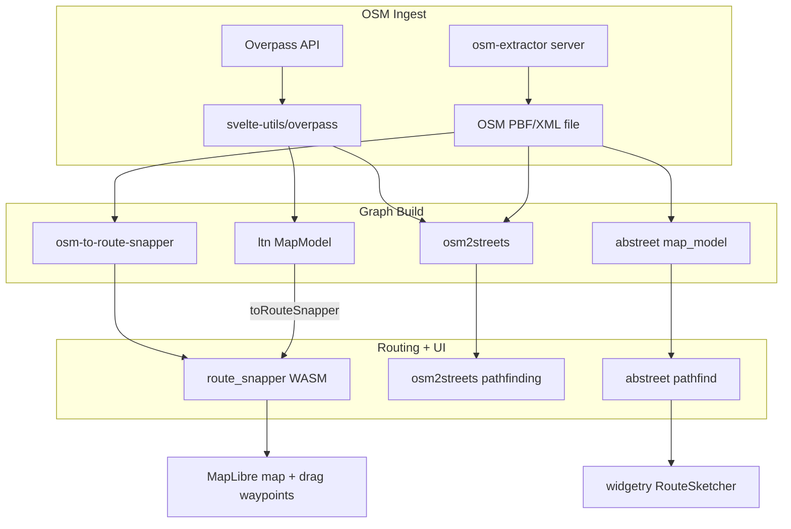

# A/B Street org: OSM → routing graph → map route → interactive drag-edit

Research date: 2026-08-10. Evidence from GitHub READMEs, source code (shallow clones in `/tmp/abstreet-research/`), deployed demos, and `gh` API queries.

**Audience:** product builders and LLM agents implementing a similar pipeline.

---

## 1. Executive summary

### Verdict: **many projects, partial coverage — compose `route_snapper` + `osm2streets`/`osm-to-route-snapper` + `svelte-utils` Overpass helpers**

No single repository in the [a-b-street GitHub org](https://github.com/a-b-street) ships all four pipeline steps as a **standalone, reusable library**. The closest end-to-end **web** experience is **[`a-b-street/ltn`](https://github.com/a-b-street/ltn)** (Low-Traffic Neighbourhood tool), which:

1. Loads OSM for a drawn polygon via **Overpass** (`svelte-utils/overpass`)
2. Builds a routable street model in Rust/WASM (`backend`)
3. Exports a **`route_snapper` graph** (`toRouteSnapper()`)
4. Draws and interactively reshapes snapped routes via **`route-snapper-ts`** (`SnapRouteSelector.svelte`)

The **interactive drag-to-adjust routing UI** itself lives in **[`dabreegster/route_snapper`](https://github.com/dabreegster/route_snapper)** — same author/ecosystem, **not** under the `a-b-street` org, but listed as an official `osm2streets` consumer and extracted from A/B Street’s “Ungap the Map” work ([route_snapper README](https://github.com/dabreegster/route_snapper/blob/main/README.md)).

| Pipeline step                            | Best match                                                                                                                                                         | Notes                                                                                 |
| ---------------------------------------- | ------------------------------------------------------------------------------------------------------------------------------------------------------------------ | ------------------------------------------------------------------------------------- |
| 1. Load area from Overpass / OSM extract | **`svelte-utils`** (`overpassQueryForPolygon`, `fetchOverpass`) + **`osm-extractor`** (server-side PBF clip)                                                       | Used by `ltn`, `15m`, `severance_snape`, `od2net`, `osm2streets/web`                  |
| 2. Build routing graph                   | **`osm-to-route-snapper`** (simple highway graph) or **`osm2streets`** + **`ltn/backend`** (rich street model) or **`abstreet/map_model`** (full simulation graph) | Depth vs complexity trade-off                                                         |
| 3. Draw route on map                     | **`route_snapper`** (MapLibre), or app-specific (`15m`, `severance_snape`)                                                                                         | MapLibre + `svelte-maplibre` is the modern web stack                                  |
| 4. Interactive drag-edit                 | **`route_snapper`** / **`ltn` `SnapRouteSelector`**                                                                                                                | Only full multi-waypoint drag UX found; `15m`/`severance_snape` have A↔B markers only |

**Top 1–3 repos to use:**

1. **[`dabreegster/route_snapper`](https://github.com/dabreegster/route_snapper)** — npm `route-snapper`, WASM routing + MapLibre drag UX (steps 2–4 for simple graphs; step 1 via `osm-to-route-snapper` or browser import tool)
2. **[`a-b-street/osm2streets`](https://github.com/a-b-street/osm2streets)** — OSM → `StreetNetwork`, lane-aware geometry, basic pathfinding; pair with `route_snapper` for interactive UI
3. **[`a-b-street/ltn`](https://github.com/a-b-street/ltn)** — reference integration: Overpass → WASM backend → `toRouteSnapper()` → `SnapRouteSelector` (copy patterns, not necessarily fork the LTN domain logic)

**Native (non-web) alternative:** [`a-b-street/abstreet`](https://github.com/a-b-street/abstreet) “Ungap the Map” mode has `RouteSketcher` with click + drag waypoint editing on a full `map_model` graph — but uses pre-imported OSM city packs, not live Overpass in the UI.

### Recommended plan: which route snapper is latest

Checked 2026-08-10. **Use [`dabreegster/route_snapper`](https://github.com/dabreegster/route_snapper)** as the current library; treat the others as wrappers or ancestors.

| Solution                                       | Role                            | Freshness (as of 2026-08-10)                                                                                                                                       | Plan action                                                                      |
| ---------------------------------------------- | ------------------------------- | ------------------------------------------------------------------------------------------------------------------------------------------------------------------ | -------------------------------------------------------------------------------- |
| **`route-snapper` / `route-snapper-ts` (npm)** | Canonical MapLibre drag-routing | npm **`route-snapper@0.4.9`** (2024-11-25), **`route-snapper-ts@0.0.9`**; git `main` last push **2026-01-04** (docs/CLI ahead of npm; crate still versioned 0.4.9) | **Depend on this** for interactive routing                                       |
| **`ltn` `SnapRouteSelector`**                  | App UI wrapping the npm package | Depends on `route-snapper@^0.4.9`; last UI touch ~2025-08 (Svelte 5)                                                                                               | **Copy integration patterns** only (Overpass → `toRouteSnapper()` → `RouteTool`) |
| **`abstreet` `RouteSketcher`**                 | Native Ungap-mode predecessor   | Older; `route_snapper` was extracted from this line; abstreet in maintenance mode                                                                                  | **Do not start here** for a new web app                                          |

**Implementation plan for this project:**

1. Install `route-snapper@0.4.9` and `route-snapper-ts@0.0.9` (or pin to git `main` if you need post-0.4.9 osm-to-route-snapper CLI/docs fixes).
2. Build or load a graph via `osm-to-route-snapper` / the [browser import tool](https://dabreegster.github.io/route_snapper/import.html), or mirror LTN’s Overpass → WASM → `toRouteSnapper()` path if the area must load live.
3. Wire MapLibre with `RouteTool` / `JsRouteSnapper` for click + drag waypoint routing.
4. Use `ltn` only as a reference (`loader.ts`, `SnapRouteSelector.svelte`, `backend/src/route_snapper.rs`) — not as the library to vendor wholesale.
5. Ignore `abstreet` `RouteSketcher` unless you need the native simulation stack.

**Fastest validation without coding:** [import graph](https://dabreegster.github.io/route_snapper/import.html) → [draw & drag](https://dabreegster.github.io/route_snapper).

---

## 2. Fit matrix

| Project                                                                       | Overpass / OSM load                                                                                           | Graph build                                     | Route draw on map                     | Interactive drag-edit                                                          | License          | Stack                         | Status                                                                                       |
| ----------------------------------------------------------------------------- | ------------------------------------------------------------------------------------------------------------- | ----------------------------------------------- | ------------------------------------- | ------------------------------------------------------------------------------ | ---------------- | ----------------------------- | -------------------------------------------------------------------------------------------- |
| **[route_snapper](https://github.com/dabreegster/route_snapper)** _(sibling)_ | OSM/PBF via `osm-to-route-snapper`; [browser import](https://dabreegster.github.io/route_snapper/import.html) | `RouteSnapperMap` bincode graph                 | MapLibre `RouteSnapper` / `RouteTool` | **Yes** — drag nodes, insert waypoints, freehand segments                      | Apache-2.0       | Rust→WASM, MapLibre, npm      | Active                                                                                       |
| **[ltn](https://github.com/a-b-street/ltn)**                                  | **Yes** — Overpass for custom areas ([README](https://github.com/a-b-street/ltn/blob/main/README.md#L35-L36)) | `backend` `MapModel` + `to_route_snapper_graph` | MapLibre + `route-snapper-ts`         | **Yes** — `SnapRouteSelector.svelte`                                           | Apache-2.0       | Rust/WASM + Svelte + MapLibre | Active ([demo](https://a-b-street.github.io/ltn))                                            |
| **[osm2streets](https://github.com/a-b-street/osm2streets)**                  | **Yes** in [StreetExplorer](https://a-b-street.github.io/osm2streets/) (`OverpassSelector.svelte`)            | `osm_to_street_network` → `StreetNetwork`       | GeoJSON render to Leaflet/MapLibre    | **No** dedicated route editor; routing listed as _planned_ in README           | Apache-2.0       | Rust (+ WASM JS bindings)     | Active                                                                                       |
| **[abstreet](https://github.com/a-b-street/abstreet)**                        | OSM via `convert_osm` / `importer` (PBF/XML files; bundled cities) — **not** live Overpass in-game            | `map_model` pathfinders (CH / Dijkstra)         | Custom `widgetry` canvas              | **Partial** — `RouteSketcher` in Ungap mode (native UI, 2+ waypoints, drag)    | Apache-2.0       | Rust native + web play build  | Maintenance mode ([2025 README](https://github.com/a-b-street/abstreet/blob/main/README.md)) |
| **[15m](https://github.com/a-b-street/15m)**                                  | **Yes** — `OverpassSelector`                                                                                  | `graph` crate, `fast_paths` CH router           | MapLibre `RouteMode.svelte`           | **Partial** — draggable **A/B** markers only, not multi-waypoint route molding | Apache-2.0       | Rust/WASM + Svelte            | Experimental ([demo](https://a-b-street.github.io/15m))                                      |
| **[severance_snape](https://github.com/a-b-street/severance_snape)**          | **Yes** — `OverpassSelector`                                                                                  | `utils::osm2graph` + walking profiles           | MapLibre `RouteMode.svelte`           | **Partial** — draggable A/B markers                                            | Apache-2.0       | Rust/WASM + Svelte            | Experimental ([demo](https://a-b-street.github.io/severance_snape))                          |
| **[od2net](https://github.com/a-b-street/od2net)**                            | **Yes** — Overpass + PBF upload in interactive app                                                            | Bulk OD routing network (`JsNetwork`)           | Heatmap / street priority layers      | **No** — draggable marker moves **origin**, not route shape                    | Apache-2.0       | Rust/WASM + Svelte            | Pre-alpha ([demo](https://od2net.org/interactive.html))                                      |
| **[speedwalk](https://github.com/a-b-street/speedwalk)**                      | **Yes** — Overpass in `LoadAnotherArea.svelte`                                                                | Sidewalk QA geometry, not general routing       | MapLibre display                      | **No** — draggable draft markers for sidewalk editing, not routing             | Apache-2.0       | Rust/WASM + Svelte            | Active ([demo](https://a-b-street.github.io/speedwalk/))                                     |
| **[svelte-utils](https://github.com/a-b-street/svelte-utils)**                | **Yes** — shared Overpass query/fetch                                                                         | N/A (UI helpers)                                | Map basemap helpers                   | N/A                                                                            | Apache-2.0       | TypeScript/Svelte             | Active                                                                                       |
| **[osm-extractor](https://github.com/a-b-street/osm-extractor)**              | GeoDesk GOL + Osmium clip; mentions Overpass as alternative                                                   | N/A                                             | N/A                                   | N/A                                                                            | (no SPDX in API) | Node.js server                | Active                                                                                       |
| **[utils](https://github.com/a-b-street/utils)**                              | `osm2graph` OSM→edge graph helper                                                                             | `Graph` intermediate structure                  | N/A                                   | N/A                                                                            | Apache-2.0       | Rust                          | Active                                                                                       |
| **[osm2lanes](https://github.com/a-b-street/osm2lanes)**                      | N/A                                                                                                           | Lane tag parsing (absorbed into osm2streets)    | N/A                                   | N/A                                                                            | —                | Rust                          | **Archived**                                                                                 |
| **[abstr](https://github.com/a-b-street/abstr)**                              | N/A                                                                                                           | OD→scenario JSON for abstreet sim               | N/A                                   | N/A                                                                            | —                | R                             | Active                                                                                       |
| **[template](https://github.com/a-b-street/template)**                        | Scaffold only                                                                                                 | —                                               | MapLibre starter                      | —                                                                              | —                | Svelte                        | Active                                                                                       |
| **[ltd-site](https://github.com/a-b-street/ltd-site)**                        | Marketing/docs site                                                                                           | —                                               | —                                     | —                                                                              | —                | —                             | Active                                                                                       |
| **[docs](https://github.com/a-b-street/docs)**                                | Documentation                                                                                                 | —                                               | —                                     | —                                                                              | —                | mdBook                        | Active                                                                                       |

---

## 3. Deep dive on best-fit projects

### 3.1 `route_snapper` (primary interactive routing component)

**Role:** Client-side MapLibre plugin to draw LineStrings/Polygons snapped to a pre-built graph. Routing runs in WASM; no remote routing API.

**Architecture:**

```
OSM XML/PBF  →  osm-to-route-snapper::convert_osm  →  RouteSnapperMap (bincode .bin)
                                                          ↓
MapLibre map  ←  route-snapper (JS)  ←  JsRouteSnapper (WASM)  ←  petgraph A* pathfind
```

**Data flow:**

1. **Graph build:** `osm-to-route-snapper` reads OSM via `osm_reader::parse`, extracts `highway=*` ways, splits into edges, optional boundary clip ([`convert_osm`](https://github.com/dabreegster/route_snapper/blob/d38660a2/osm-to-route-snapper/src/lib.rs#L13-L36)).
2. **Graph schema:** `route_snapper_graph::RouteSnapperMap` — nodes (`Coord`), edges (`Edge` with geometry + optional directional costs) ([`lib.rs`](https://github.com/dabreegster/route_snapper/blob/d38660a2/route-snapper-graph/src/lib.rs#L4-L40)).
3. **Pathfinding:** `JsRouteSnapper` builds `DiGraphMap`, routes with `petgraph::algo::astar` (Euclidean heuristic; default cost = edge length) ([`pathfind`](https://github.com/dabreegster/route_snapper/blob/d38660a2/route-snapper/src/lib.rs#L1186-L1206)).
4. **Interaction:** Waypoints (`Snapped` node or `Free` coord), modes `Neutral | Hovering | Dragging | Freehand`; drag recalculates `full_path` ([`Route` struct](https://github.com/dabreegster/route_snapper/blob/d38660a2/route-snapper/src/lib.rs#L106-L133)).
5. **TS wrapper:** `route-snapper-ts` `RouteTool` wires MapLibre events to WASM ([`index.ts`](https://github.com/dabreegster/route_snapper/blob/d38660a2/route-snapper-ts/src/index.ts#L33-L50)).

**Run / demo:**

- Live demo: https://dabreegster.github.io/route_snapper
- Graph import tool: https://dabreegster.github.io/route_snapper/import.html
- Local dev: `cd examples && ./serve_locally.sh` ([README](https://github.com/dabreegster/route_snapper/blob/main/README.md#L22-L27))
- npm: `npm i route-snapper` ([user guide](https://github.com/dabreegster/route_snapper/blob/main/user_guide.md))

**Caveats (from docs):** Default OSM import uses Euclidean distance; may ignore one-way restrictions; routes are for sketching, not turn-by-turn navigation ([npm registry summary](https://www.npmjs.com/package/route-snapper)).

---

### 3.2 `a-b-street/ltn` (reference full-stack web integration)

**Role:** LTN planning app — demonstrates the full Overpass → graph → interactive route pipeline in production.

**Architecture:**

```
User draws polygon  →  svelte-utils Overpass  →  OSM XML bytes
        ↓
Backend::new(osm, boundary)  →  MapModel (LTN street network + filters)
        ↓
toRouteSnapper()  →  bincode graph bytes  →  RouteTool(map, bytes)
        ↓
SnapRouteSelector  →  calculateRoute(waypoints)  →  GeoJSON LineString  →  finish(road_ids)
```

**Key integration points:**

- Overpass fetch: [`loader.ts`](https://github.com/a-b-street/ltn/blob/9f461b86/web/src/title/loader.ts#L98-L106) uses `overpassQueryForPolygon` + `safeFetch`.
- Route tool init after load: [`afterProjectLoaded`](https://github.com/a-b-street/ltn/blob/9f461b86/web/src/title/loader.ts#L116-L126) calls `backend.toRouteSnapper()` and constructs `RouteTool`.
- Graph export: [`backend/src/route_snapper.rs`](https://github.com/a-b-street/ltn/blob/9f461b86/backend/src/route_snapper.rs#L9-L28) maps `MapModel` roads/intersections → `RouteSnapperMap`.
- Interactive UI: [`SnapRouteSelector.svelte`](https://github.com/a-b-street/ltn/blob/9f461b86/web/src/edit/SnapRouteSelector.svelte) — click to add waypoints, drag markers, `getExtraNodes` for mid-route insertion, `routeTool.inner.calculateRoute`.

**Demo:** https://a-b-street.github.io/ltn — draw/import area, use route drawing for neighbourhood boundaries (user guide describes red/blue waypoint dragging).

---

### 3.3 `a-b-street/osm2streets` (OSM → street network + light pathfinding)

**Role:** Lane-aware street network from OSM; foundation for rendering and analysis. Routing exists as a **simple subset**, not a full router product.

**Pipeline** ([`docs/how_it_works.md`](https://github.com/a-b-street/osm2streets/blob/fc119c47/docs/how_it_works.md)):

1. `osm_to_street_network` — parse OSM, split ways at intersections → `StreetNetwork`
2. `apply_transformations` — merge dual carriageways, collapse intersections, snap sidepaths, etc.

**Pathfinding API** ([`pathfinding.rs`](https://github.com/a-b-street/osm2streets/blob/fc119c47/osm2streets/src/pathfinding.rs)):

- `path_dist_to(from, to)` — Dijkstra on driving graph
- `simple_path(from, to, lane_types)` — A\* returning `Vec<(RoadID, Direction)>`
- Comment: _"A/B Street's map_model has lots of pathfinding support... This is a deliberately simple subset"_

**Overpass in web:** [`OverpassSelector.svelte`](https://github.com/a-b-street/osm2streets/blob/fc119c47/web/src/common/osm_input/OverpassSelector.svelte) builds Overpass QL polygon query and fetches XML.

**Planned (README, not implemented as product):** isochrones, map-matching, full routing score functions.

---

### 3.4 `a-b-street/abstreet` (native simulation + Ungap route sketcher)

**Role:** Full traffic simulation; map import pipeline is the most sophisticated graph builder, but UI is native `widgetry`, not MapLibre.

**OSM import:** `convert_osm::convert` → `RawMap` → `map_model::Map` ([`importer/src/lib.rs`](https://github.com/a-b-street/abstreet/blob/0964f293/importer/src/lib.rs)). Cities ship as pre-built `.bin` maps; CLI can import new cities from OSM files ([user guide](https://a-b-street.github.io/docs/user/new_city.html)).

**Pathfinding:** `map_model::pathfind` — contraction hierarchies for vehicles, Dijkstra for walking/transit ([`vehicles.rs`](https://github.com/a-b-street/abstreet/blob/0964f293/map_model/src/pathfind/vehicles.rs), [`walking.rs`](https://github.com/a-b-street/abstreet/blob/0964f293/map_model/src/pathfind/walking.rs)).

**Interactive route sketching:** `RouteSketcher` in Ungap “Quick sketch” mode ([`route_sketcher.rs`](https://github.com/a-b-street/abstreet/blob/0964f293/apps/game/src/common/route_sketcher.rs)):

- Click intersections to set start/end waypoints
- Drag nodes on the path to reshape (`move_waypoint` recalculates via `map.simple_path_btwn_v2`)
- UI text: _"Click and drag to adjust the route"_ (line 169)
- Provenance: evolved into `route_snapper` for web MapLibre ([route_snapper README “Related work”](https://github.com/dabreegster/route_snapper/blob/main/README.md#L35-L37))

**Web play build:** https://play.abstreet.org — includes Ungap mode but still uses bundled maps, not arbitrary Overpass import.

---

### 3.5 Adjacent: `15m`, `severance_snape`, `od2net`

These share the **Svelte + MapLibre + WASM + Overpass** template (`a-b-street/template` lineage) but target analysis, not general-purpose route editing.

| App                 | Routing                                                           | Drag interaction                                                                                                                                                                     |
| ------------------- | ----------------------------------------------------------------- | ------------------------------------------------------------------------------------------------------------------------------------------------------------------------------------ |
| **15m**             | `graph::Router` with `fast_paths` CH; `backend.route(start, end)` | Draggable A/B markers; route recalculates on drag ([`RouteMode.svelte`](https://github.com/a-b-street/15m/blob/d78bf7ed/web/src/RouteMode.svelte#L192-L194))                         |
| **severance_snape** | Walking graph from `utils::osm2graph` + custom crossing costs     | Same A/B pattern ([`RouteMode.svelte`](https://github.com/a-b-street/severance_snape/blob/9cc2b854/web/src/RouteMode.svelte))                                                        |
| **od2net**          | Bulk shortest paths for OD demand                                 | Draggable **marker** repositions analysis origin, not route waypoints ([`InteractiveApp.svelte`](https://github.com/a-b-street/od2net/blob/main/web/src/InteractiveApp.svelte#L155)) |

`15m/graph` also has multi-waypoint routing in Rust (`calculate_route` with `waypoints: Vec<IntersectionID>`) ([`route.rs`](https://github.com/a-b-street/15m/blob/d78bf7ed/graph/src/route.rs#L315-L326)) — but the **web UI does not expose** mid-route drag editing.

---

## 4. Code references

Paths use `main` branch blob URLs; pinned commits noted where shallow-cloned.

### 4.1 Overpass / OSM ingest

| Symbol / file             | Purpose                                      | URL                                                                                                                          |
| ------------------------- | -------------------------------------------- | ---------------------------------------------------------------------------------------------------------------------------- |
| `overpassQueryForPolygon` | Build Overpass QL for polygon clip           | [svelte-utils `osm/index.ts`](https://github.com/a-b-street/svelte-utils/blob/696aad38/src/lib/osm/index.ts#L11-L28)         |
| `fetchOverpass`           | POST query to Overpass interpreter           | [svelte-utils `osm/index.ts`](https://github.com/a-b-street/svelte-utils/blob/696aad38/src/lib/osm/index.ts#L45-L65)         |
| `OverpassSelector.svelte` | osm2streets web import UI                    | [osm2streets](https://github.com/a-b-street/osm2streets/blob/fc119c47/web/src/common/osm_input/OverpassSelector.svelte)      |
| `osm_to_street_network`   | OSM bytes → `StreetNetwork`                  | [streets_reader `lib.rs`](https://github.com/a-b-street/osm2streets/blob/fc119c47/streets_reader/src/lib.rs#L28-L46)         |
| `convert_osm`             | osm-to-route-snapper OSM → `RouteSnapperMap` | [route_snapper `lib.rs`](https://github.com/dabreegster/route_snapper/blob/d38660a2/osm-to-route-snapper/src/lib.rs#L15-L36) |
| `convert_osm::convert`    | abstreet full map import                     | [abstreet importer](https://github.com/a-b-street/abstreet/blob/0964f293/importer/src/lib.rs)                                |
| `Graph::new` (osm2graph)  | severance_snape / utils OSM scrape           | [utils `osm2graph.rs`](https://github.com/a-b-street/utils/blob/main/src/osm2graph.rs)                                       |
| `osm-extractor` server    | POST polygon → clipped PBF                   | [README](https://github.com/a-b-street/osm-extractor/blob/main/README.md)                                                    |

### 4.2 Graph construction

| Symbol / file                          | Purpose                             | URL                                                                                                                     |
| -------------------------------------- | ----------------------------------- | ----------------------------------------------------------------------------------------------------------------------- |
| `RouteSnapperMap`                      | Serializable routing graph          | [route_snapper-graph](https://github.com/dabreegster/route_snapper/blob/d38660a2/route-snapper-graph/src/lib.rs#L4-L18) |
| `MapModel::to_route_snapper_graph`     | LTN model → route_snapper graph     | [ltn `route_snapper.rs`](https://github.com/a-b-street/ltn/blob/9f461b86/backend/src/route_snapper.rs#L10-L28)          |
| `StreetNetwork::apply_transformations` | osm2streets simplification pipeline | [how_it_works.md](https://github.com/a-b-street/osm2streets/blob/fc119c47/docs/how_it_works.md)                         |
| `Router::new` (LTN)                    | fast_paths CH from MapModel roads   | [ltn `route.rs`](https://github.com/a-b-street/ltn/blob/9f461b86/backend/src/route.rs#L99-L149)                         |
| `VehiclePathfinder`                    | abstreet CH vehicle routing         | [abstreet `vehicles.rs`](https://github.com/a-b-street/abstreet/blob/0964f293/map_model/src/pathfind/vehicles.rs)       |

### 4.3 Pathfinding / route generation

| Symbol / file                          | Algorithm                         | URL                                                                                                                            |
| -------------------------------------- | --------------------------------- | ------------------------------------------------------------------------------------------------------------------------------ |
| `Router::pathfind` (route_snapper)     | A\* on `DiGraphMap`               | [route_snapper `lib.rs`](https://github.com/dabreegster/route_snapper/blob/d38660a2/route-snapper/src/lib.rs#L1186-L1206)      |
| `StreetNetwork::simple_path`           | A\* by lane type                  | [osm2streets `pathfinding.rs`](https://github.com/a-b-street/osm2streets/blob/fc119c47/osm2streets/src/pathfinding.rs#L31-L68) |
| `map.pathfind` / `simple_path_btwn_v2` | abstreet multi-modal              | [abstreet `map_model`](https://github.com/a-b-street/abstreet/tree/main/map_model/src/pathfind)                                |
| `graph::Router` (15m)                  | fast_paths CH                     | [15m `route.rs`](https://github.com/a-b-street/15m/blob/d78bf7ed/graph/src/route.rs#L27-L49)                                   |
| `do_route` (severance_snape)           | Walking route + severance metrics | [severance_snape `route.rs`](https://github.com/a-b-street/severance_snape/blob/9cc2b854/backend/src/route.rs#L13-L24)         |

### 4.4 Map UI + waypoint / drag interaction

| Symbol / file              | Interaction model                    | URL                                                                                                                                   |
| -------------------------- | ------------------------------------ | ------------------------------------------------------------------------------------------------------------------------------------- |
| `JsRouteSnapper`           | Full snap/drag/freehand route editor | [route_snapper `lib.rs`](https://github.com/dabreegster/route_snapper/blob/d38660a2/route-snapper/src/lib.rs#L30-L54)                 |
| `RouteTool` (TS)           | MapLibre event binding               | [route-snapper-ts `index.ts`](https://github.com/dabreegster/route_snapper/blob/d38660a2/route-snapper-ts/src/index.ts)               |
| `SnapRouteSelector.svelte` | LTN integration pattern              | [ltn](https://github.com/a-b-street/ltn/blob/9f461b86/web/src/edit/SnapRouteSelector.svelte)                                          |
| `RouteSketcher`            | Native abstreet click/drag           | [abstreet `route_sketcher.rs`](https://github.com/a-b-street/abstreet/blob/0964f293/apps/game/src/common/route_sketcher.rs#L162-L170) |
| `RouteMode.svelte` (15m)   | A/B draggable markers only           | [15m](https://github.com/a-b-street/15m/blob/d78bf7ed/web/src/RouteMode.svelte#L192-L194)                                             |

### 4.5 WASM / JS API surface (agents)

```typescript
// LTN pattern (after OSM load)
import { RouteTool } from 'route-snapper-ts'
const graphBytes = backend.toRouteSnapper() // Uint8Array
routeTool.set(new RouteTool(map, graphBytes, routeToolGj, snapMode, undoLength))

// Calculate route from waypoints
const gj = JSON.parse(routeTool.inner.calculateRoute(waypoints))
// gj.properties.full_path → snapped node IDs per step
```

```rust
// osm2streets
use streets_reader::osm_to_street_network;
let (mut streets, _doc) = osm_to_street_network(&osm_bytes, clip_pts, cfg, timer)?;
streets.apply_transformations(vec![/* Transformation enums */], timer);
let path = streets.simple_path(from_i, to_i, &[LaneType::Driving])?;
```

```rust
// route_snapper graph build (CLI/library)
use osm_to_route_snapper::convert_osm;
let map = convert_osm(osm_bytes, boundary_gj, /*road_names=*/ true)?;
let bytes = bincode::serialize(&map)?;
```

---

## 5. How an agent would reuse this

### Recommended composition (web)

```
svelte-utils/overpass  →  OSM XML bytes
        ↓
osm-to-route-snapper::convert_osm  OR  custom exporter to RouteSnapperMap
        ↓
route-snapper npm package (WASM) + MapLibre
        ↓
copy SnapRouteSelector patterns from ltn for app-specific UX
```

### Crates vs WASM vs copy

| Need                                 | Depend on                                                 | Avoid                                                                           |
| ------------------------------------ | --------------------------------------------------------- | ------------------------------------------------------------------------------- |
| Interactive drag routing on MapLibre | npm `route-snapper` + `route-snapper-ts`                  | Reimplementing drag logic from scratch                                          |
| OSM polygon extract in browser       | Copy `svelte-utils/overpass` (small, MIT-style patterns)  | Hardcoding single Overpass server                                               |
| Rich street geometry / lanes         | `osm2streets` crate or `osm2streets-js` WASM              | Expecting stable API without contacting maintainers (README warns API unstable) |
| Turn restrictions, modes, simulation | `abstreet/map_model`                                      | Pulling entire abstreet for a sketch tool                                       |
| Server-side large extracts           | `osm-extractor` or Geofabrik PBF + `osm-to-route-snapper` | Huge Overpass queries in browser                                                |

### Licensing

Most Rust/TS projects: **Apache-2.0**. Safe for commercial use with attribution. `abstr` (R) has no SPDX id in GitHub API — check CRAN/LICENSE file if bundling.

### Vendor vs depend

- **Depend (npm/crates.io/git):** `route-snapper`, `route-snapper-graph`, `osm2streets`, `osm_reader`
- **Copy patterns (not fork):** `SnapRouteSelector.svelte`, `svelte-utils/overpass` (~60 lines core logic)
- **Do not vendor wholesale:** `abstreet` (large monorepo), `ltn` domain logic

### Gaps to fill yourself

- **Overpass → route_snapper in one browser step:** LTN does Overpass → own MapModel → route_snapper; shortcut is Overpass → XML → `convert_osm` in WASM (not pre-packaged as single crate in org — would need wiring)
- **Turn restrictions / one-way** in route_snapper default graph: not enforced ([user guide caveat](https://github.com/dabreegster/route_snapper/blob/main/user_guide.md))
- **Custom cost functions** (cycling safety, etc.): set `forward_cost`/`backward_cost` on edges when building graph, or use osm2streets + custom exporter
- **Map matching GPS traces:** listed as planned in osm2streets README, not shipped

---

## 6. Gaps / non-matches

Explicit **not provided** by the a-b-street org as a turnkey library:

| Gap                                                 | Detail                                                                                     |
| --------------------------------------------------- | ------------------------------------------------------------------------------------------ |
| **Single npm crate for full pipeline**              | Must compose `route_snapper` + OSM ingest + optional `osm2streets`                         |
| **Interactive route drag in osm2streets**           | StreetExplorer visualizes streets; no route editor                                         |
| **Interactive route drag in 15m / severance_snape** | Only endpoint markers; no mid-route waypoint molding                                       |
| **Interactive route drag in od2net**                | Network planning / OD heatmaps, not turn-by-turn UX                                        |
| **Live Overpass in abstreet game**                  | Uses pre-imported city maps                                                                |
| **Production-grade routing**                        | route_snapper defaults are sketching-oriented; abstreet pathfinding is simulation-oriented |
| **osm2lanes**                                       | Archived; functionality merged into osm2streets / `muv_osm`                                |
| **route_snapper in a-b-street org**                 | Lives under `dabreegster/route_snapper` — same author, external repo                       |

---

## 7. Sources

### GitHub repositories (consulted 2026-08-10)

| Repo                       | Commit (shallow clone) | URL                                           |
| -------------------------- | ---------------------- | --------------------------------------------- |
| a-b-street/abstreet        | `0964f293`             | https://github.com/a-b-street/abstreet        |
| a-b-street/osm2streets     | `fc119c47`             | https://github.com/a-b-street/osm2streets     |
| a-b-street/ltn             | `9f461b86`             | https://github.com/a-b-street/ltn             |
| a-b-street/15m             | `d78bf7ed`             | https://github.com/a-b-street/15m             |
| a-b-street/severance_snape | `9cc2b854`             | https://github.com/a-b-street/severance_snape |
| a-b-street/od2net          | main (not cloned)      | https://github.com/a-b-street/od2net          |
| a-b-street/svelte-utils    | `696aad38`             | https://github.com/a-b-street/svelte-utils    |
| a-b-street/utils           | main                   | https://github.com/a-b-street/utils           |
| a-b-street/osm-extractor   | main                   | https://github.com/a-b-street/osm-extractor   |
| a-b-street/speedwalk       | main                   | https://github.com/a-b-street/speedwalk       |
| a-b-street/osm2lanes       | archived               | https://github.com/a-b-street/osm2lanes       |
| dabreegster/route_snapper  | `d38660a2`             | https://github.com/dabreegster/route_snapper  |

### Documentation & demos

- osm2streets StreetExplorer: https://a-b-street.github.io/osm2streets/
- LTN tool: https://a-b-street.github.io/ltn
- 15-minute tool: https://a-b-street.github.io/15m
- Severance Snape: https://a-b-street.github.io/severance_snape
- od2net: https://od2net.org / https://od2net.org/interactive.html
- route_snapper demo: https://dabreegster.github.io/route_snapper
- route_snapper import: https://dabreegster.github.io/route_snapper/import.html
- A/B Street play: https://play.abstreet.org
- Ungap the Map docs: https://a-b-street.github.io/docs/software/ungap_the_map/index.html
- osm2streets how it works: https://github.com/a-b-street/osm2streets/blob/main/docs/how_it_works.md
- npm route-snapper: https://www.npmjs.com/package/route-snapper
- Overpass API wiki: https://wiki.openstreetmap.org/wiki/Overpass_API

### Org inventory

Full public repo list from `gh api orgs/a-b-street/repos` (20 repos, Aug 2026).

---

## 8. Agent checklist — prototype the pipeline

Copy-paste steps for a minimal web prototype:

```bash
# 1. Scaffold (optional)
git clone https://github.com/a-b-street/template.git my-route-app
cd my-route-app/web && npm ci

# 2. Add routing dependencies
npm install route-snapper route-snapper-ts maplibre-gl svelte-maplibre

# 3. Copy Overpass helpers from svelte-utils (or depend on published package if available)
#    - overpassQueryForPolygon, fetchOverpass from src/lib/osm/index.ts

# 4. Build graph from OSM (choose one):
#    A) Browser: https://dabreegster.github.io/route_snapper/import.html → download .bin
#    B) CLI:
git clone https://github.com/dabreegster/route_snapper.git
cd route_snapper/osm-to-route-snapper
cargo run --release -- -i /path/to/area.osm.xml -b /path/to/boundary.geojson -o snap.bin

# 5. Wire MapLibre + RouteTool (see route_snapper/examples/index.html)
#    - await init() from route-snapper
#    - new RouteSnapper(map, graphBytes) OR RouteTool wrapper
#    - listen for route updates

# 6. For Overpass-driven flow, mirror ltn/web/src/title/loader.ts:
#    - fetchOverpass(overpassQueryForPolygon(boundary)) → OSM XML ArrayBuffer
#    - Pass bytes to WASM backend OR pre-convert to snap.bin server-side
#    - backend.toRouteSnapper() OR convert_osm() → RouteTool

# 7. For drag UX, study ltn/web/src/edit/SnapRouteSelector.svelte
#    - waypoints: { point: [lng,lat], snapped: boolean }[]
#    - routeTool.inner.calculateRoute(waypoints)
#    - routeTool.inner.getExtraNodes(wp1, wp2) for mid-route inserts
```

**Validation checklist:**

- [ ] Polygon Overpass query returns OSM XML for test area
- [ ] Graph file loads in WASM without panic (`JsRouteSnapper::new`)
- [ ] Click two+ points → LineString snaps to roads
- [ ] Drag intermediate node → route recalculates
- [ ] Export `full_path` / road IDs for downstream use

**Fastest path to “see it work” without coding:** open https://dabreegster.github.io/route_snapper/import.html → draw boundary → download graph → open https://dabreegster.github.io/route_snapper → load graph → draw and drag route.

---

## Appendix: ecosystem map (mermaid)


